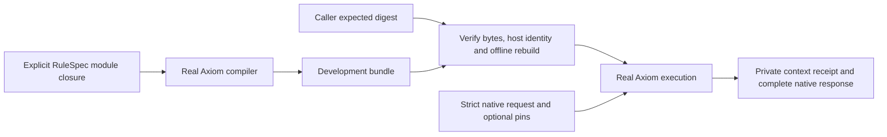

# Axiom core

A working local prototype of immutable rule bundles and strict execution over
the real Axiom Rust engine. Every calculation runs through
`axiom-rules-engine`; the Python adapter and demo contain no policy evaluator.

This is the first checkpoint of the [architecture proposal](docs/architecture.md),
revised after [Fable's Subfleet review](docs/fable-review.md). Bundles are
**unsigned development artifacts**, and the example rules are synthetic.
The [build status](docs/implementation-status.md) records verification and scope.

## Run it

Use Rust 1.94.1 (pinned in `rust-toolchain.toml`) and Python 3.10 or later. The first Cargo
build needs access to the pinned engine repository and locked crate packages.
Subsequent bundle compilation, verification, and execution use only local data.

```sh
cargo build --locked --workspace
python3 scripts/demo.py
```

The demo compiles two explicit RuleSpec modules, verifies the resulting bundle,
and executes the same synthetic household in 2026, in 2027, and with a rule pin.
It saves the exact CLI binary, bundle, identity, original requests, and full receipts in a fresh
directory under `output/`. Each run prints that directory and actual engine
outputs. The fixture is a software contract example, with no legal meaning.

For individual operations:

```sh
target/debug/axiom-core capabilities
target/debug/axiom-core build --spec fixtures/synthetic-household.json --out /tmp/axiom-demo.bundle.json
# Copy bundle_sha256 from the build response into EXPECTED_BUNDLE_SHA256.
target/debug/axiom-core verify --bundle /tmp/axiom-demo.bundle.json --expect "$EXPECTED_BUNDLE_SHA256"
target/debug/axiom-core run --bundle /tmp/axiom-demo.bundle.json --expect "$EXPECTED_BUNDLE_SHA256" --request fixtures/request-2026.json
```

`build` refuses to overwrite an existing file. `run` also accepts native request
JSON on stdin. The [Python transport](python/README.md) invokes these operations
and returns the entire receipt without maintaining another set of schema models.

## What works



- Bundles retain exact source strings, their resolved import closure, compiler
  options, and compiled executable bytes, with separate hashes.
- Verification requires a caller-supplied expected manifest digest, checks every
  source and executable byte, and recompiles the closure with the pinned engine.
- Engine identity binds its Git revision, native version, artifact format, this
  workspace's dependency lockfile, and the actual CLI executable bytes.
- Execution rejects unsupported request fields, duplicate JSON keys, duplicate
  pins, reversed intervals, and any supplied `assessment_date`, including null.
- Native pins affect execution. Stored baseline artifact bytes remain unchanged.
  Absent pins and an empty pin list have the same scenario identity.
- CLI and Python retain the native output, metadata, and complete explanation
  traces, including rounding details and parameter reads.

The exact executable match is intentionally conservative: a rebuilt, stripped,
or different-platform CLI may require rebuilding the development bundle. Keep
the original binary to replay its bundles. This is a local identity check, not
remote attestation or a guarantee of reproducible compiler toolchains.

## Contract and limits

[Prototype contract](docs/prototype-contract.md) defines the bundle and receipt
identities, trust boundary, native schema compatibility, and unsupported behavior.
The engine is pinned to revision
`d142c645917817cf590e036fb99f99b2d4780e1a`; dependencies are locked in `Cargo.lock`.

Hash verification proves integrity against a supplied digest. It does not
authenticate an author, validate law, or establish that an oracle workload is
independent. This checkpoint has no admission signer, publication selector,
service, durable job system, or integration with signed source releases.

The existing engine's type soundness, checked arithmetic, and hostile-program
isolation are not established by this wrapper. Use trusted development source.
Receipts contain private query identifiers, pins, and traces. Keep them private;
the context hash is not a unique household or result identifier. Replay also
requires the original private dataset.

## Development

```sh
cargo fmt --all --check
cargo clippy --locked --workspace --all-targets -- -D warnings
cargo test --locked --workspace
cargo build --locked --workspace
python3 -m unittest discover -s python/tests -v
```

Tests exercise the real compiler and runtime, including altered bundles, wrong
engine identity, import closure, strict parsing, periods, pins, and CLI/Python
receipt equality. Synthetic tests establish software behavior only.

The next checkpoint is one real program across two signed source revisions,
with an independently authorized expected workload and explicit evidence.
Admission and publication should follow that integration.
