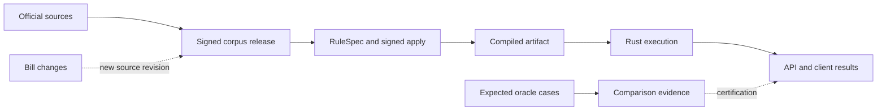

**Axiom architecture review — 4 September 2026**

The core separation is worth keeping: official-source ingestion, immutable corpus releases, country RuleSpec repositories, a shared Rust runtime, independent comparisons, and consumer APIs. The main weakness is that guarantees established in one component are not consistently preserved by the next. A request can lose a counterfactual, a remote execution can inherit a different deployment's provenance, and a comparison can lose part of its denominator while retaining a perfect score.

Source links point to the exact Git revisions reviewed. Reproduction files and detailed lane reports marked as local archive were retained outside this repository and are unavailable through GitHub; their reported results below have not been rerun for publication.

This was a read-only review of freshly fetched upstream source, with independent runtime, encoding/oracle, and API review lanes. The original checkouts and their uncommitted changes were preserved. Findings describe the reviewed code; they do not establish that a production user has already received an incorrect result.

**Highest-priority findings**

1. **[P1] Remote execution does not establish that it ran the artifact named in the response.** The TypeScript API expects `/health` to return `programs`, while the Rust execution service returns `packages`. Consequently, the API never learns the loaded package set and continues treating availability as true. More importantly, `/run` sends only jurisdiction, program name, and request; it neither supplies an expected artifact digest nor checks an executed digest. The certification wrapper attaches artifact identity from the API's local package lock. A staggered API/runtime rollout can therefore execute one artifact while returning another artifact's identity and associated certification context.

   Evidence: [health parser and optimistic availability](https://github.com/TheAxiomFoundation/axiom-api/blob/9bed01ec384ae55fc033de7f597d1c76f28cc660/src/runtime-compiled.ts#L386), [Rust health and package lookup](https://github.com/TheAxiomFoundation/axiom-api/blob/9bed01ec384ae55fc033de7f597d1c76f28cc660/rust/src/lib.rs#L52), [remote request](https://github.com/TheAxiomFoundation/axiom-api/blob/9bed01ec384ae55fc033de7f597d1c76f28cc660/src/runtime-compiled.ts#L703), [response provenance](https://github.com/TheAxiomFoundation/axiom-api/blob/9bed01ec384ae55fc033de7f597d1c76f28cc660/src/runtime-factory.ts#L715). An offline protocol reproduction shows the API advertising an absent package as ready and dispatching it to a 404; the mismatched-artifact scenario follows from the unchecked protocol, not an observation of production.

   Fix: version the execution protocol, require an expected artifact digest, have the worker verify it against resident bytes, and return the executed artifact and engine identities. Check those before attaching certificates. Unknown health schema or failed initial discovery should produce unavailable/unknown status.

2. **[P1] Python and Rust expose different execution semantics for the same request.** Rust supports `CompiledExecutionRequest.pins`; the Python model omits it and silently ignores extra fields. The same request through the real CLI returns a pinned value of `0`; through the Python client it returns the baseline `123.46`. Python also drops trace fields including entity identity, executed expressions, parameter reads, and rounding evidence. These are losses of calculation intent and audit evidence at the binding boundary.

   Evidence: [Python request and trace models](https://github.com/TheAxiomFoundation/axiom-rules-engine/blob/d142c645917817cf590e036fb99f99b2d4780e1a/python/axiom_rules_engine/models.py#L101), [Rust trace fields](https://github.com/TheAxiomFoundation/axiom-rules-engine/blob/d142c645917817cf590e036fb99f99b2d4780e1a/src/api.rs#L584), actual CLI/Python reproduction (`runtime-probes/python-contract-results.json`, local archive; unavailable in this GitHub repository).

   Fix: maintain one versioned wire schema, generate or mechanically check bindings against it, reject unsupported request fields, and run identical requests through CLI/Python/WASM/HTTP in compatibility tests. Assert preservation of trace evidence as well as numeric output.

3. **[P2] Oracle reports can show 100% agreement after silently dropping required work.** `Comparator.compare` skips a household if the right-hand engine has no result, and drops a mapping when neither engine returns its value. The accumulator counts only the comparisons that survive. The public compare command rejects an entirely empty run, but accepts partial omissions. Evidence validation reconciles the saved rows with the report's own counts, so it does not restore the missing expected denominator.

   Evidence: [comparison filtering](https://github.com/TheAxiomFoundation/axiom-oracles/blob/0912a10fa5c14d16ed4fed2a501e38ba8325c180/axiom_oracles/comparison/comparator.py#L58), [accumulator](https://github.com/TheAxiomFoundation/axiom-oracles/blob/0912a10fa5c14d16ed4fed2a501e38ba8325c180/axiom_oracles/comparison/report.py#L128), [CLI publication path](https://github.com/TheAxiomFoundation/axiom-oracles/blob/0912a10fa5c14d16ed4fed2a501e38ba8325c180/axiom_oracles/cli.py#L811), [evidence reconciliation](https://github.com/TheAxiomFoundation/axiom-oracles/blob/0912a10fa5c14d16ed4fed2a501e38ba8325c180/axiom_oracles/evidence.py#L1710). Two-case fixtures demonstrate both omission classes retaining perfect agreement and zero errors; the resulting report content passes its reconciliation check. This is a demonstrated report-integrity problem, not a demonstrated bypass of the encoder's signed-apply gate.

   Fix: bind evidence to an immutable manifest of expected case IDs and requested output IDs. Reject duplicates, unexpected IDs, and missing results; represent unsupported/skipped cases explicitly. Require `expected = compared + explicitly excluded + failed`, with exclusions visible and governed separately from accuracy.

4. **[P2] Successful compilation does not guarantee that scalar values satisfy declared types.** A RuleSpec rule declaring `dtype: Money` with a text formula compiles and executes successfully, returning `dtype: decimal`, `unit: USD`, and `value.kind: text`. The executable artifact therefore carries contradictory type information. Separately, an accepted Decimal maximum input to `x + 1` panics instead of returning a structured arithmetic error.

   Evidence: real compiled Money/text result (`runtime-probes/money_is_text-result.json`, local archive; unavailable in this GitHub repository), runtime boundary reproductions (`runtime-probes/runtime-boundary-results.json`, local archive; unavailable in this GitHub repository), and runtime review (`runtime-review.md`, local archive; unavailable in this GitHub repository). These probes exercise the actual Rust implementation. They do not establish that the production encoding pipeline would approve those particular source files.

   Fix: define the invariants of a validated executable artifact, check formula/result compatibility and units, and validate typed inputs at every execution entry point. Use checked arithmetic with structured errors. The direct, uncompiled execution entry point also needs the compiler's graph validation before accepting externally supplied programs.

**Further architectural gaps**

5. **[P2] Bill-triggered work is deduplicated by citation rather than by source revision.** The queue's unique key is `(bill, citation, reason)`, and scanning skips existing rows regardless of status. A new supersession after an earlier run creates no new work item. The runner marks an exit-zero result `ran` without checking whether the selected corpus release includes the enacted amendment. The README correctly warns that an early run can re-encode pre-enactment law; the state machine does not enforce that prerequisite or automatically retry when a suitable release arrives.

   Evidence: [deduplication](https://github.com/TheAxiomFoundation/axiom-bills/blob/603ae318d015c334ef1de4dd767486944da3af71/packages/scrapers/src/axiom_bills/_common/encode_queue.py#L211), [runner completion](https://github.com/TheAxiomFoundation/axiom-bills/blob/603ae318d015c334ef1de4dd767486944da3af71/packages/scrapers/src/axiom_bills/_common/encode_queue.py#L347), [documented source prerequisite](https://github.com/TheAxiomFoundation/axiom-bills/blob/603ae318d015c334ef1de4dd767486944da3af71/README.md#L221). An offline database fixture reproduces a new supersession producing zero pending jobs after the previous jobs were marked `ran`.

   Fix: include bill-text, corpus-release, and baseline-encoding identities in the work item; distinguish awaiting-source, ready, attempted, validated, and applied. Preserve dismissal for the exact event reviewed, while allowing a materially new source revision to create new work.

6. **[P2] Historical identity is inconsistent across corpus consumers.** The legacy SQLite/Postgres archive APIs accept `as_of` but ignore it. Storing a 2020 version followed by a 2026 version and requesting 2020 returns the 2026 text. This limitation is documented, but the request still looks successful. Separately, axiom-bills reads `current_provisions` without selecting a release/version identity and permanently caches positive hits by citation unless explicitly forced. A persistent local database can keep the old text after activation of a new release. The scheduled federal workflow uses a fresh SQLite database, which limits that particular cache problem in CI.

   Evidence: [SQLite lookup](https://github.com/TheAxiomFoundation/axiom-corpus/blob/3ecdb83f9c3474bc293566d5ba9fdd046ef286b6/src/axiom_corpus/storage/sqlite.py#L222), [Postgres lookup](https://github.com/TheAxiomFoundation/axiom-corpus/blob/3ecdb83f9c3474bc293566d5ba9fdd046ef286b6/src/axiom_corpus/storage/postgres.py#L271), [bill source selection](https://github.com/TheAxiomFoundation/axiom-bills/blob/603ae318d015c334ef1de4dd767486944da3af71/packages/scrapers/src/axiom_bills/_common/corpus_client.py#L147), [cache hit behavior](https://github.com/TheAxiomFoundation/axiom-bills/blob/603ae318d015c334ef1de4dd767486944da3af71/packages/scrapers/src/axiom_bills/_common/corpus_client.py#L244).

   Fix: reject unsupported historical lookups until implemented. Distinguish legal effective date, source observation date, and immutable release identity. Cache source records under a release/content identity and pin that identity for the duration of a bill-diff or encoding run.

7. **[P2] The architecture viewer describes superseded trust boundaries as current.** It names `corpus.provisions` as the source of truth and describes navigation/count refresh on load; the corpus now explicitly treats the database as a projection and separates staging, signed publication, and transactional activation. ADR 0003 still says applies use HMAC with a shared environment key; the current encoder uses Ed25519 and separate trust roots. These are operationally significant differences, not just old component counts.

   Evidence: [viewer storage model](https://github.com/TheAxiomFoundation/axiom-architecture/blob/6e9f1a889f58d14fe5c5be0fd943d2f9a82200b2/src/architecture.ts#L227), [old signing ADR](https://github.com/TheAxiomFoundation/axiom-architecture/blob/6e9f1a889f58d14fe5c5be0fd943d2f9a82200b2/docs/decisions/0003-signed-apply-manifests.md#L15), [current corpus publication contract](https://github.com/TheAxiomFoundation/axiom-corpus/blob/3ecdb83f9c3474bc293566d5ba9fdd046ef286b6/docs/named-release-publication.md#L5), encoding review (`encode-review.md`, local archive; unavailable in this GitHub repository).

   Fix: mark obsolete ADRs superseded, document the replacement decisions, and make the viewer identify the repository revision against which each implementation claim was checked. Put durable cross-repository contracts under explicit ownership and test their examples in CI.

8. **[P2] Async API jobs persist records without making execution durable.** Job requests, position, and partial results live in process memory; the distributed store holds status. A terminated invocation leaves pending/running work with no lease recovery or retry. The supported limit of 50 requests, four workers, and a 10-second per-request timeout can take about 130 seconds against the configured 60-second host duration. The endpoint advertises durability based on the store, although the work cannot resume.

   Evidence: [job limits and execution](https://github.com/TheAxiomFoundation/axiom-api/blob/9bed01ec384ae55fc033de7f597d1c76f28cc660/src/jobs.ts#L8), [in-memory worker state](https://github.com/TheAxiomFoundation/axiom-api/blob/9bed01ec384ae55fc033de7f597d1c76f28cc660/src/jobs.ts#L108), [host duration](https://github.com/TheAxiomFoundation/axiom-api/blob/9bed01ec384ae55fc033de7f597d1c76f28cc660/vercel.json#L5). This is a code-established lifecycle gap; no production timeout or load test was run.

   Fix: persist work payloads and partial results, use leased/idempotent workers with retries, and mark abandoned jobs failed. Until that exists, narrow the advertised contract and cap work to the hosting budget.

**What is working well**

- The corpus release boundary is carefully specified: content-addressed source artifacts, exact inventories and projection digests, Ed25519 verification, separation of staging from activation, and transactional scope activation. A failed or partial ingest need not alter serving. This is a strong basis for reproducibility.
- The encoder selects an exact signed corpus release through the target RuleSpec checkout's toolchain configuration. Bill text is not silently substituted for approved source law. Keep this trust boundary while making the workflow wait for the correct release.
- Country repositories give cross-jurisdiction imports a shared revision. A shared Rust runtime and declarative program assembly are appropriate boundaries; the binding drift calls for stronger compatibility tests, not separate policy implementations.
- The engine explicitly rejects unsupported compiled artifact format versions. Extend that discipline to request/response schemas and remote execution identity.

**A maintainability risk worth addressing**

The encoder's CLI is about 62,900 lines and its validator pipeline about 36,000 lines. Size alone is not a defect, but model generation, heuristic repairs, admission verification, and transactional installation occupy a very large shared review surface. The admission verifier and installer should become small deterministic components with explicit inputs. In particular, repairs that change test scenarios need an independent baseline contract; a signature proves which repaired test bytes passed, not that the original scenario retained its meaning. See the encoding review (`encode-review.md`, local archive; unavailable in this GitHub repository) for the specific repair paths and limits of this observation.

**Recommended sequence**

First, repair the demonstrated losses: Python pins/trace preservation, remote digest verification, oracle completeness, and scalar type/arithmetic checks. Add regression fixtures that cross real component boundaries. Existing unit tests pass around several of these defects because they test each component's own interpretation of the interface.

Then standardize an execution identity containing the corpus release content hash, RuleSpec commit, composition/closure hash, compiled artifact hash, engine identity, wire-schema version, and certification evidence identity. Much of this already exists locally; the missing work is requiring agreement between consumers and workers and returning the identity actually used.

Finally, make change propagation operate on those identities. An amendment event, an encoding attempt, and an activated result are different states. Persist transitions and retries, and close a work item only when its required source revision and validation evidence are accounted for. Update the architecture viewer after those contracts are agreed.

**Reviewed revisions**

| Repository | Upstream main commit |
|---|---|
| axiom-architecture | `6e9f1a889f58d14fe5c5be0fd943d2f9a82200b2` |
| axiom-corpus | `3ecdb83f9c3474bc293566d5ba9fdd046ef286b6` |
| axiom-bills | `603ae318d015c334ef1de4dd767486944da3af71` |
| axiom-encode | `7ec9e574155e0f674825535fd43c448d081eeb2b` |
| axiom-oracles | `0912a10fa5c14d16ed4fed2a501e38ba8325c180` |
| axiom-rules-engine | `d142c645917817cf590e036fb99f99b2d4780e1a` |
| axiom-api | `9bed01ec384ae55fc033de7f597d1c76f28cc660` |
| axiom-mcp | `279f47c11676bc0e92cea10237f7a1749e0d8cd1` |

**Verification and limits**

The corpus/bills probes run offline using temporary SQLite databases: reproduction script (`corpus-bills-repros.py`, local archive; unavailable in this GitHub repository). The relevant existing suites pass: 8 corpus storage tests and 20 bill queue/corpus-client tests. Runtime probes use a Rust binary built from the reviewed snapshot and the snapshot Python client. The API lane ran 63 focused tests and an offline remote-protocol reproduction. The runtime lane passed 27 Rust tests and 8 Python tests; the oracle lane passed 11 comparator/report tests and ran omission/evidence probes. Across these focused suites, 137 existing tests passed. Focused encoder trust tests could not run in the available environments because required dependencies were missing; no pass is claimed for them. Detailed lane reports contain additional scoped findings and their limitations: runtime (`runtime-review.md`, local archive; unavailable in this GitHub repository), encoding/oracles (`encode-review.md`, local archive; unavailable in this GitHub repository), API/MCP (`api-review.md`, local archive; unavailable in this GitHub repository).

This is a sampled architectural review, not a full security audit, legal validation, or production deployment assessment. No production writes, signing operations, or load tests were performed. GitNexus did not provide usable graph results, and a context lookup failed on a database-format mismatch; findings were checked directly against frozen source and focused executions.

Three additional Subfleet peer reviews were attempted, produced no usable output by the bounded cutoff, and were stopped. This review relies on the completed local review lanes and their reproductions, not those unfinished external reviews.
