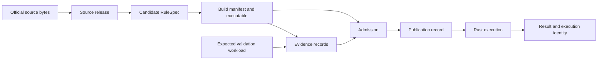

# Building Axiom from scratch

**Proposal v2 · 4 September 2026 · Revised after Fable review; initial build authorized**

I would build Axiom around immutable executable rule bundles, a small admission service, and one shared rules engine. A bundle would identify the sources, rules, dependency closure, compiler, and executable bytes that produced a result. Validation would attach explicit evidence to that identity. Publication would select which admitted bundle an application serves.

The first engineering objective would be one complete, reproducible program across two source revisions and every supported execution interface. Broader coverage would follow once source changes, counterfactuals, interrupted jobs, historical queries, and rollbacks work through that same path.

This is a proposed design, not a description of shipped Axiom behavior or authorization to replace the existing system. The [preceding architecture review](architecture-review.md) supplies concrete failure cases that inform the design. Its snapshots and evidence remain the basis for statements about current code; this document has not refreshed those repositories.

## Review decisions and immediate scope

Fable reviewed the [frozen v1](architecture-v1.md) through Subfleet. [Review metadata](fable-review-metadata.json) records the model, run, and reviewed hash. The [review](fable-review.md) and [response/build scope](fable-response.md) preserve its findings and the main author's decisions. That review covered v1; it is not an approval of this revised version or an implementation. Any later PR review is recorded separately against its reviewed commit.

Archive note: the frozen v1 file retains its original local architecture-review link so its reviewed SHA-256 remains unchanged. That link does not resolve on GitHub; use this repository's [architecture review](architecture-review.md) to read the publication copy. The [Fable review](fable-review.md) is also preserved byte-for-byte.

The target architecture below is larger than the checkpoint now being built. Start with a local `axiom-core` Cargo workspace: explicit RuleSpec closure, immutable development bundle, pinned real engine, strict request handling, complete responses, and a thin Python transport. Use synthetic fixtures to prove software contracts first. Signed admission, a real released program with independent evidence, generated rich clients, publication, and services follow as separate deliverables. Existing signed corpus releases are the source authority to integrate; this work does not replace their ingestion or signing design.

The initial execution-context object binds `bundle_sha256`, `artifact_sha256`, actual engine revision/version, dependency-lock and executing-binary digests, wire version, canonical scenario and its hash, and normalized queries. Its hash uses the same versioned canonical encoding as the manifest. Pins are sorted by rule identifier, duplicate pins are rejected, and absent pins normalize to the explicit empty scenario. Baseline and explicitly empty scenarios therefore have equal identities; a changed pin changes context identity without changing stored artifact bytes. This is execution-context identity, not a unique household/result identity. Replay additionally requires the caller's original private dataset.

Any supplied `assessment_date`, including null, is rejected until knowledge-time selection exists. The initial manifest lists only the guarantees actually enforced: byte/source-closure/engine identity and strict request/response preservation. Type-system soundness, checked arithmetic across backends, and dimensional period inference remain unverified engine capabilities and are not inferred from successful compilation.

Local execution receipts are private. A public registry contains policy/source artifacts, never private queries or household-input digests. A future service may publicly hash only expressly public policy scenarios; private scenario identities use tenant-scoped keyed digests or opaque handles. Rule-level overrides are not automatically public merely because they are called pins.

## 1. The product contract

For every calculation, Axiom should answer four questions: what inputs were used, which rules executed, which source versions those rules represent, and what evidence supports the result. A caller should be able to reproduce an old result without querying a mutable source mirror or reconstructing a deployment from memory.

The initial product supports deterministic household or case calculations, explanation traces, explicit counterfactuals, and bounded batch execution. It also supports publishing source-linked rules and their validation evidence. Population-scale optimization, automatic legal interpretation of arbitrary amendments, and full historical-knowledge reconstruction are later capabilities with explicit acceptance criteria.

Acceptance is scoped. “Compiled successfully,” “source excerpts checked,” “independently reviewed,” and “agreed with a specified oracle workload” are separate claims. A signature attributes a claim to an authority and binds its bytes; it does not establish that an interpretation of law is correct.

## 2. One software repository, independently versioned legal content

The software monorepo would contain five modules. These are code ownership boundaries, not five network services.

| Module | Owns | Must not own |
|---|---|---|
| Contract | Wire schemas, canonical encoding, identifiers, compatibility fixtures | Program-specific policy logic |
| Engine | RuleSpec parsing, typed IR, compilation, execution, trace semantics | Source fetching, signing, deployment selection |
| Admission | Evidence verification, publication policy, signed acceptance records | Model prompting, heuristic repairs, test authoring |
| Pipeline | Source adapters, encoding workers, comparison runners, durable work | Authority to declare its own output accepted |
| Gateway | Authentication, request routing, quotas, retrieval, client adapters | A parallel calculation implementation |

Rust owns the engine and canonical execution schema. Python owns ingestion, encoding, and experimental analysis orchestration. TypeScript owns the browser interface and thin API adapters where useful. Generated bindings and shared fixtures make a schema change an atomic software change. Generated files are checked into releases so ordinary consumers do not need the entire build toolchain.

Each country repository holds atomic legal rules, declarative program definitions, concept names, and tests. Program definitions have one authoritative home and release with the law they compose. Cross-country dependencies, when necessary, are explicit immutable imports. A build resolves the entire dependency closure once; execution never searches ambient checkouts or imports from a moving branch.

The monorepo reduces coordination cost, but it does not eliminate the need to version released protocols and preserve compatibility for external clients. Code owners and package dependency checks keep admission independent of generation code. A future service split requires a concrete scaling, operational, or ownership reason.

## 3. Immutable objects and the serving boundary

The storage model separates objects that change for different reasons:

| Object | Identity and contents |
|---|---|
| Source snapshot | Exact publisher bytes, fetch provenance, normalized text, adapter version, source/normalization hashes |
| Source release | Canonical manifest of allowed snapshots/provisions, scope and known gaps, signature |
| Build manifest | Source release, country commits, rule/import closure, composition specification, compiler build, executable artifact hashes, supported semantics |
| Evidence record | Build identity, expected workload identity, results or review decision, producer identity and signature |
| Admission record | Build identity, accepted evidence records, admission-policy version, permitted claims and use scope |
| Publication record | Logical serving name, admission identity, activation generation and predecessor |

The executable bundle is the build manifest plus its referenced artifacts. It can be transported as one archive or fetched as a closure of content-addressed objects. Physical packaging does not change logical identity.

Hashes have precise meanings: source-closure hash, compiled-artifact hash, and bundle-manifest hash are different fields. A canonical manifest hashes its payload without its signature or its own digest. Evidence references an existing build; admission references existing build and evidence objects. Adding a review therefore creates a new admission record without changing executable bytes or creating a circular hash dependency.

Object writes are immutable and idempotent. PostgreSQL stores search/navigation projections and an index of these objects. A serving pointer is mutable, but activation transactionally checks the expected predecessor, reference reservations for already verified immutable objects, and admission policy. Object-store availability itself is not part of a PostgreSQL transaction; storage retention and reference reservations prevent GC between verification and activation. Concurrent activations cannot silently overwrite each other. A transactional outbox records activation events for dependent workers.

Object hashes establish integrity after retrieval. Signatures and configured trusted public roots establish who authorized the release. Neither proves that a publisher website was authentic or that an adapter extracted every applicable provision; source admission needs explicit publisher provenance and coverage evidence.

## 4. Define execution semantics before building the encoder

The reference engine takes an immutable executable, validated inputs, and a request. It has no network access and performs no implicit source discovery. It returns values, diagnostics, and an execution identity; explain mode additionally returns structured trace evidence.

The initial type system covers booleans, enums, text, dates, bounded integers, and fixed-precision decimals with explicit currency/unit annotations. Percentages are dimensionless ratios. Entity relations have declared source/target types and cardinality requirements. Formula branches must have compatible result types. Arithmetic overflow, division by zero, invalid periods, missing inputs, and invalid entity relations return typed errors or explicitly modeled domain outcomes.

Missing facts are never implicitly zero or false. A rule may explicitly declare a legally justified default. Unknown, not applicable, and an actual zero are distinguishable. Query periods are validated; annual and monthly amounts cannot be combined through an implicit period conversion. Currency scale, rounding mode, intermediate rounding points, and interval endpoints are part of the language semantics and conformance fixtures.

The target compiler checks imports, cycles, types, branch compatibility, available parameter versions, units, and entity/period constraints that are statically decidable. This is an implementation goal, not a guarantee provided by the engine revision used in the initial checkpoint. Input-dependent constraints remain runtime checks. A successful compile promises conformance to those executable invariants, not substantive legal correctness.

The reference interpreter defines the semantics of the shared typed IR. Python, native CLI, HTTP workers, and WASM execute that IR through the real Axiom engine. Optimized execution must preserve required output/error semantics against the same conformance suite. I would start with decimal scalar execution and chunked batches. A float or vectorized backend earns admission separately by meeting an explicit equivalence or documented approximation contract; it is never silently substituted for exact execution.

Request schemas reject unknown fields. Response schemas preserve additive evidence fields across adapters, with explicit schema versions and capability discovery. Required new semantics cause a compatibility failure rather than being discarded. CI runs the same counterfactual, temporal, error, and explanation fixtures through every supported client, including comparisons of evidence fields.

## 5. Time and legal identity

A legal rule has a stable internal identity and versioned citation aliases. A moved or renumbered provision need not become an unrelated rule merely because its path changes. Split and merged provisions require explicit lineage edges rather than guessing identity from similar text.

Three times remain separate: the interval when a rule legally applies, the time Axiom observed a source, and the time a release was published. The first implementation selects legal-effective versions from an explicitly chosen bundle and records that bundle. A historical query either finds a supported version or returns an unsupported-history error.

“Calculate under the law effective on date D using bundle B” is an initial supported operation. “Reconstruct what an administrator could have known on date K” is a separate bitemporal capability and is unavailable until source knowledge intervals and selection rules are implemented. The initial executor rejects any supplied assessment date; it never echoes an unsupported knowledge-time request as if it were fulfilled. A retroactive amendment produces a new source/build history; old bundles remain available under their original identities.

The compiler records dependencies on imported rules, definitions, parameters, and explicit legal source scope. An amendment conservatively marks candidate dependents for reassessment. An unchanged quoted sentence is insufficient evidence that a new exception or definition does not affect a rule. Automated impact detection proposes scope; closure review remains necessary for uncertain semantic effects.

## 6. Admission and evidence

Generation workers produce proposals. They may repair code and author candidate tests, but those outputs remain untrusted. The admission component receives immutable candidate bytes and evidence references through a small typed interface. It checks digests, signatures, allowed toolchain identities, source release membership, workload completeness, required claims, and scope restrictions before issuing an admission record.

The semantic trusted computing base includes the compiler/runtime, validation runners, source extractors, and the authorities that establish legal interpretations. Making the admission component small makes its authorization logic reviewable; it does not make those dependencies disappear. Validation runs execute in controlled environments with declared inputs, bounded resources, and no signing credentials. The signer accepts the admission component's decision for exact bytes under a versioned policy.

Independent baseline tests have separate ownership from encoder-generated tests. A proposal may request a baseline change, with a reason and source reference; it cannot silently repair the acceptance workload to fit its generated output. Legal review decisions identify the reviewed source and rule versions and the scope of interpretation approved. Automated and human evidence can coexist without implying they are interchangeable.

Every comparison begins with a frozen workload manifest of expected case IDs, requested outputs, exclusions, and tolerances. Each requested pair is accounted for exactly once as compared, failed/missing, or explicitly excluded. Duplicate and unexpected IDs are errors. Exclusions and independence categories are part of the frozen workload. Admission requires its hash to be authorized by baseline owners independently of the generation pipeline; wall-clock ordering alone is not an enforceable independence check. Reports show coverage and agreement separately and bind their denominators to the workload hash.

An oracle report records oracle build/data identities, adapter versions, requests, and outcome evidence where retention permissions allow. It also records which inputs were independently observed versus borrowed from another model's calculations. Coverage is reported per claim, separating independently exercised, borrowed/not independently exercised, excluded, and failed/missing work. Borrowed intermediates lower independent coverage even when aggregate agreement is high. Programs without a suitable oracle can be published with different explicit claims; absence of an oracle is not concealed as a passing comparison.

Admission policies are scoped by intended use and program. An experimental bundle may be inspectable without being the default production calculation. Applications request an assurance profile, and publication/serving checks that the admission satisfies it. Revocation creates an append-only advisory/status event: historical bytes and evidence remain inspectable, while current policy can prohibit their use for new production calculations. Key rotation preserves verification of historical records and explicitly identifies compromised keys and affected admissions.

## 7. Execution, counterfactuals, and privacy

For a published program, the gateway resolves the requested serving name to an admission/build identity exactly once. It sends the worker the expected executable digest and compatible engine identity. The worker verifies its resident bytes, checks compatibility, and returns the identities it actually used. A mismatch produces an error before certificates are attached to a response. Health discovery uses that same versioned contract and reports unknown/unavailable when it cannot establish readiness.

An on-demand composition resolves and persists its complete source/rule closure before compiling. Counterfactual overrides form a canonical scenario object with a new identity. If specialization changes executable bytes, it gets a new artifact hash; if overrides are runtime parameters, the execution identity includes their canonical scenario hash. Neither path presents a modified calculation as the baseline artifact alone. Experimental scenarios retain baseline lineage but do not inherit validation claims that no longer apply.

A response identifies the bundle, artifact, engine build, request schema, scenario, legal period, and applicable admission evidence. Multi-target results retain each target's identity and trace. Batch outputs are bound to input row IDs and support per-case trace retrieval against the same executable and retained private inputs.

Household inputs and detailed result traces remain private. Public artifact hashes must not accidentally publish guessable hashes of sensitive household attributes. Authorized replay uses caller-held inputs or encrypted tenant-scoped records with access control, retention, and deletion policies. A private request identifier can use a keyed digest; reproducibility does not require retaining personal inputs indefinitely. A deleted input record makes later server-side replay unavailable, which is explicitly reported rather than reconstructed from logs.

## 8. Durable processing and a small initial deployment

The initial deployment has one gateway, a worker pool, PostgreSQL, an object store, and a signing/admission process isolated by credentials. The gateway can call Rust in process for short calculations or route to workers; either path uses the same identity contract. Long jobs use workers with an appropriate execution lifetime rather than relying on a response handler remaining alive.

PostgreSQL initially owns the job queue. Each job stores immutable input references, required source/build identities, progress, attempts, leases, and partial result references. Workers claim jobs transactionally, renew leases, and write idempotent outputs. Lease generations fence late writers after reassignment. Job effects are at least once, with idempotency keys and compare-and-swap finalization; exactly-once execution is not assumed. Retry budgets and terminal failure states prevent abandoned jobs from looking indefinitely active.

The encoding workflow is:

`awaiting source → ready → encoding → validation → review → admitted → published`

Each transition records the event and artifact/evidence identities that justify it. Failures and requested changes branch into explicit retry or rejection states. A bill notification cannot advance beyond awaiting-source until an appropriate ingested release is linked to the amendment. A changed bill/source/baseline revision creates a new event identity. Dismissal applies to the reviewed event, preserving the ability to process a later material change.

Search indexes and navigation are rebuildable projections. Published sources, builds, admission evidence, and release history have an explicit retention policy and backup/restore tests. Temporary candidate artifacts can be garbage-collected after a configured retention period once they are unreferenced by retained records. Reference state and GC claims live in PostgreSQL; GC uses fenced eligibility decisions and a grace period, not an object-store listing. Local pointer updates likewise need a lock plus predecessor check; atomic rename alone is not compare-and-swap. Operators need alerts on failed activation, abandoned leases, identity mismatches, missing evidence, and source lag; a broad operations dashboard follows those concrete signals.

## 9. First complete release milestone

After the local identity/execution checkpoint, the first real program should be small enough to review completely but include a household/person relation, a threshold or piecewise formula, an effective-date change, and one composed dependency. Select it with an independently authored workload and usable official sources. Avoid choosing only constant-return examples that conceal integration problems.

| Stage | Deliverable | Exit condition |
|---|---|---|
| Contract and interpreter | Typed IR, exact arithmetic, generated clients, error/trace schema | Identical semantic fixtures through native and Python; unsupported fields fail loudly |
| Sources and bundles | Two immutable source revisions, RuleSpec closure, executable manifest | Both revisions reproducible offline; changed bytes fail verification |
| Admission | Frozen expected workload, evidence records, isolated policy/signing | Missing/duplicate oracle cases and unauthorized test changes fail admission |
| Serving | Artifact-bound gateway, browser/WASM support, explicit scenarios | Cross-client result/trace agreement; mismatched remote artifacts rejected; counterfactual identities differ |
| Operations | Durable jobs, activation, rollback, source-change flow | Kill/restart a worker, retry, race activations, and restore from backup without losing identities or work |

The resulting end-to-end acceptance exercise must reject unsupported client fields and assessment dates, preserve traces across Python/CLI, reject unauthorized workload hashes and duplicate cases, keep build identity unchanged when adding admission evidence, distinguish engine builds sharing an artifact format, and reject legal dates outside the supported range. It must also calculate both historical versions, preserve missing-versus-zero semantics, apply a counterfactual, show the supporting sources, survive a worker interruption, reject an incomplete comparison, reject a runtime/artifact mismatch, and reproduce a pre-rollback result. Timings and memory are measured on the milestone workload; optimization follows observed bottlenecks.

Only then expand to a second program family and jurisdiction. That expansion tests whether composition, entity relations, and source adapters are actually generic. It is also the point to decide which operations need dedicated services and which optimized execution paths merit investment.

## 10. What this implies for today's Axiom

This target can guide incremental work. Existing signed corpus releases, country repositories, real Rust/WASM execution, and exact artifact pins provide substantial starting material. The earliest repairs are the observed contract losses: Python pins/trace fields, remote artifact identity, comparison denominators, runtime type checks, and job state.

After those repairs, extract the admission boundary and unify protocol/conformance fixtures. Migrate one existing program to the complete bundle/evidence/publication contract, serving it alongside the prior path under explicit identities. Require parity and replay evidence before changing the default. Retire duplicate schemas and program definitions once consumers have moved. Repository consolidation is useful when it lowers ongoing coordination costs; it is not a prerequisite for fixing the production boundaries.

The decisions still requiring empirical evidence are the exact scalar numeric bounds, the first program, throughput targets, storage/trace retention limits, and the resources needed to execute the milestones. The architectural commitment is narrower: explicit immutable inputs, a shared execution contract, independently scoped evidence, and recoverable state transitions must survive every interface.
